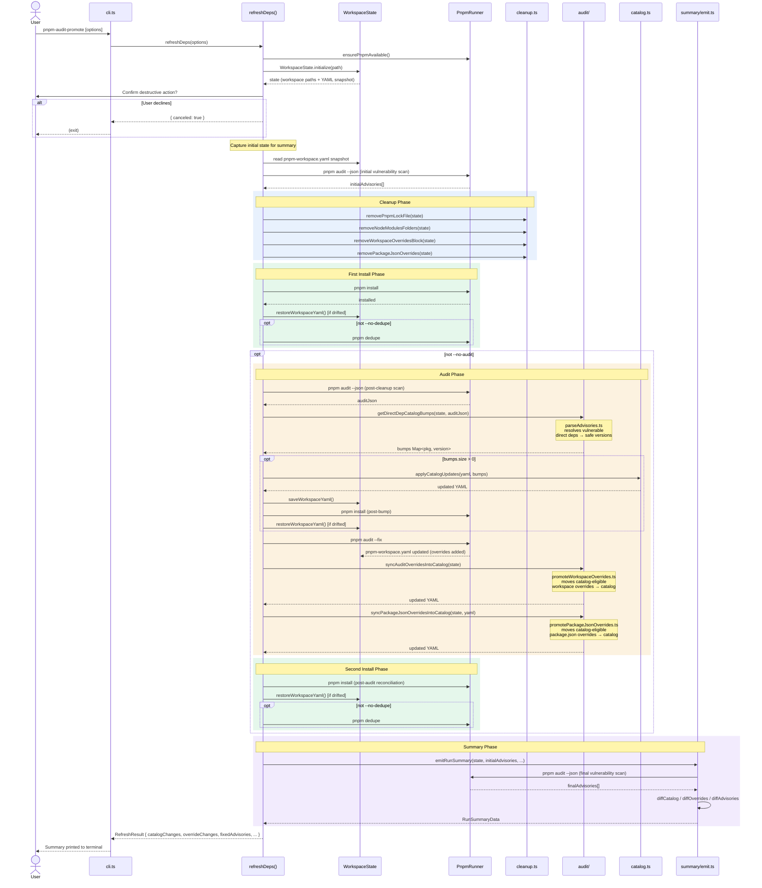

# CLI Process Sequence Diagram

```mermaid
sequenceDiagram
    actor User
    participant CLI as cli.ts
    participant Refresh as refreshDeps()
    participant WS as WorkspaceState
    participant Pnpm as PnpmRunner
    participant Cleanup as cleanup.ts
    participant Audit as audit/
    participant Catalog as catalog.ts
    participant Summary as summary/emit.ts

    User->>CLI: pnpm-audit-promote [options]
    CLI->>Refresh: refreshDeps(options)

    Refresh->>Pnpm: ensurePnpmAvailable()
    Refresh->>WS: WorkspaceState.initialize(path)
    WS-->>Refresh: state (workspace paths + YAML snapshot)

    Refresh->>User: Confirm destructive action?
    alt User declines
        Refresh-->>CLI: { canceled: true }
        CLI-->>User: (exit)
    end

    Note over Refresh: Capture initial state for summary
    Refresh->>WS: read pnpm-workspace.yaml snapshot
    Refresh->>Pnpm: pnpm audit --json (initial vulnerability scan)
    Pnpm-->>Refresh: initialAdvisories[]

    rect rgba(100, 160, 240, 0.15)
        Note over Refresh,Cleanup: Cleanup Phase
        Refresh->>Cleanup: removePnpmLockFile(state)
        Refresh->>Cleanup: removeNodeModulesFolders(state)
        Refresh->>Cleanup: removeWorkspaceOverridesBlock(state)
        Refresh->>Cleanup: removePackageJsonOverrides(state)
    end

    rect rgba(80, 200, 120, 0.15)
        Note over Refresh,Pnpm: First Install Phase
        Refresh->>Pnpm: pnpm install
        Pnpm-->>Refresh: installed
        Refresh->>WS: restoreWorkspaceYaml() [if drifted]
        opt not --no-dedupe
            Refresh->>Pnpm: pnpm dedupe
        end
    end

    opt not --no-audit
        rect rgba(230, 170, 50, 0.15)
            Note over Refresh,Catalog: Audit Phase
            Refresh->>Pnpm: pnpm audit --json (post-cleanup scan)
            Pnpm-->>Refresh: auditJson

            Refresh->>Audit: getDirectDepCatalogBumps(state, auditJson)
            Note over Audit: parseAdvisories.ts<br/>resolves vulnerable<br/>direct deps → safe versions
            Audit-->>Refresh: bumps Map<pkg, version>

            opt bumps.size > 0
                Refresh->>Catalog: applyCatalogUpdates(yaml, bumps)
                Catalog-->>Refresh: updated YAML
                Refresh->>WS: saveWorkspaceYaml()
                Refresh->>Pnpm: pnpm install (post-bump)
                Refresh->>WS: restoreWorkspaceYaml() [if drifted]
            end

            Refresh->>Pnpm: pnpm audit --fix
            Pnpm-->>WS: pnpm-workspace.yaml updated (overrides added)

            Refresh->>Audit: syncAuditOverridesIntoCatalog(state)
            Note over Audit: promoteWorkspaceOverrides.ts<br/>moves catalog-eligible<br/>workspace overrides → catalog
            Audit-->>Refresh: updated YAML

            Refresh->>Audit: syncPackageJsonOverridesIntoCatalog(state, yaml)
            Note over Audit: promotePackageJsonOverrides.ts<br/>moves catalog-eligible<br/>package.json overrides → catalog
            Audit-->>Refresh: updated YAML
        end

        rect rgba(80, 200, 120, 0.15)
            Note over Refresh,Pnpm: Second Install Phase
            Refresh->>Pnpm: pnpm install (post-audit reconciliation)
            Refresh->>WS: restoreWorkspaceYaml() [if drifted]
            opt not --no-dedupe
                Refresh->>Pnpm: pnpm dedupe
            end
        end
    end

    rect rgba(170, 120, 240, 0.15)
        Note over Refresh,Summary: Summary Phase
        Refresh->>Summary: emitRunSummary(state, initialAdvisories, ...)
        Summary->>Pnpm: pnpm audit --json (final vulnerability scan)
        Pnpm-->>Summary: finalAdvisories[]
        Summary->>Summary: diffCatalog / diffOverrides / diffAdvisories
        Summary-->>Refresh: RunSummaryData
    end

    Refresh-->>CLI: RefreshResult { catalogChanges, overrideChanges, fixedAdvisories, ... }
    CLI-->>User: Summary printed to terminal
```
